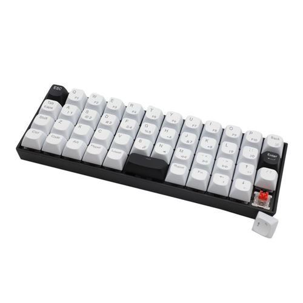

# BashfulDeck

A Cyberdeck, one that looks fun!

## Overview

I noticed that a lot of the designs for cyberdecks are one-offs that are pretty tailored for exactly one use. What if more of us allowed our designs to be starting points for someone else to bash together a kit?
I ended up stuffing a Pine LORA radio, a better Wi-Fi module and a Raspberry Pi 4 to control it all in this box, you may want to use a different SBC so I made the inside pretty roomy for you to play around. 

### Display

 
Waveshare 7inch Capacitive Touch Screen LCD (C), 1024×600, HDMI, IPS, Low Power
Buy one [here!](https://www.waveshare.com/7inch-HDMI-LCD-C.htm "Link to buy one")

### Keyboard

 
Inland 47-Keys Hot Swappable RGB Wired Mechanical Keyboard 
Buy one [here!](https://www.microcenter.com/product/661264/inland-47-keys-hot-swappable-rgb-wired-mechanical-keyboard)

### Speakers:  
 
Small Square Speaker 25*15mm 8ohm 2w Plastic Mini Wireless Speaker Driver 
Buy one [here!](https://hiawathahobbies.com/products/miniatronics-digital-command-control-speakers-oval-15-x-25mm-8-ohm-1-watt-mnt6011501)

### Connectivity
 
There's an opening that fits most USB extensions, and another next to it that fits common panel mount USBC cables 

 
8in. USB 3.2 Gen 2 Type-C Male to Female High Quality Panel Mount Cable 
Buy one [here!](https://www.coolgear.com/product/usb-3-1-type-c-male-female-high-quality-panel-mount-cable) 

There's a 15mm hole that accommodates lots of different switches on the market 

There are 2 holes on the bottom piece that fit standard 1/4–36 thread SMA plugs 

And that's it!  

### Links to Printed parts:

Everything is in PLA, only the bottom needs supports. 

1x Bashful Base [file](/Bashful/BashfulBase.stl) 
1x Bashful Bottom [file](/Bashful/BashfulBottom.stl) 
1x Bashful Top [file](/Bashful/BashfulTop.stl) 
2x Bashful Speaker Cover [file](/Bashful/BashfulSpeakerCover.stl) 

#### Building Steps:
*Print everything out 
*Insert the guts of your choice glue them safely in place
*Find a battery that fits/is as large as you need, connect it to the USBC outlet
*Insert speakers
*Glue the speaker covers on top of the speakers and connect them to your sound
*Use 2.5mm x 5mm screws to screw everything in place
*ENJOY

### Want to change the design?
Here's the .skp [file](/Bashful/BashfulDeck.3mf) 
